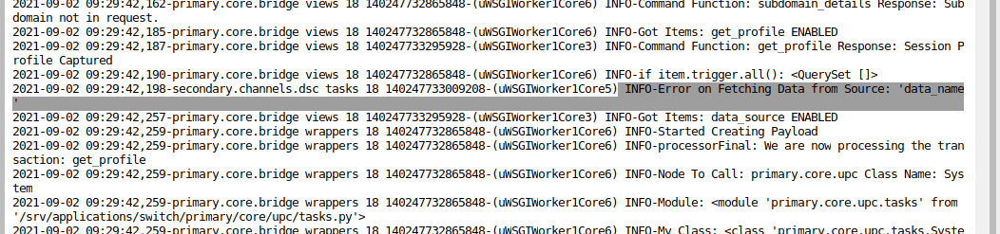
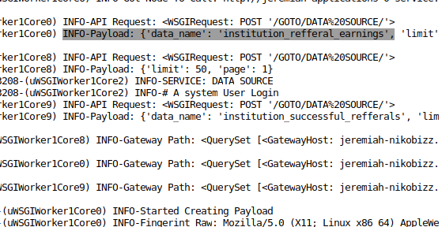
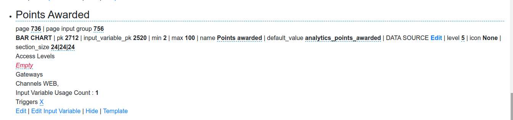
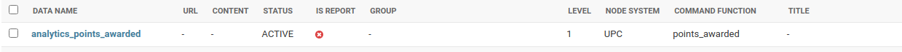

## ISSUES

 The BAR CHART element doesn't generate a payload with the data_name despite having configured the data list(data name) with a command function. Check error below in logs:
 
  </img>
 
 I checked the logs from the SUMMARY BOXES element; it generates a payload with the data_name as shown:(data is displayed in SUMMARY BOXES)
 
  </img>
 
 
 I configured the BAR CHART element with the default_value set to 'analytics_points_awarded' and created a data list with the data_name set to 'analytics_points_awarded'; i also have a command function which will populate the BAR CHART with dummy data.
 
  </img>
 
  </img>
 


I had created a data.py file on the selected node(upc) as below:
```
#primary/core/upc/data.py

class Data:
	def points_awarded(self, payload, gateway_profile, profile_tz, data):
		params = {}
		params['cols'] = []

		params['data'] = []
		params['lines'] = []

		max_id = 0
		min_id = 0
		ct = 0
		push = {}
        
		lgr.info('Started points_awarded')
        
		item1 = [23, 56, 74, 65, 63]
		item2 = [36, 34, 47, 55, 32]
        
		params['rows'] = [item1, item2]       

		return params,max_id,min_id,ct    

```

I can't seem to display data into the BAR CHART element since i capturing the data_name is impossible(No payload generated).

