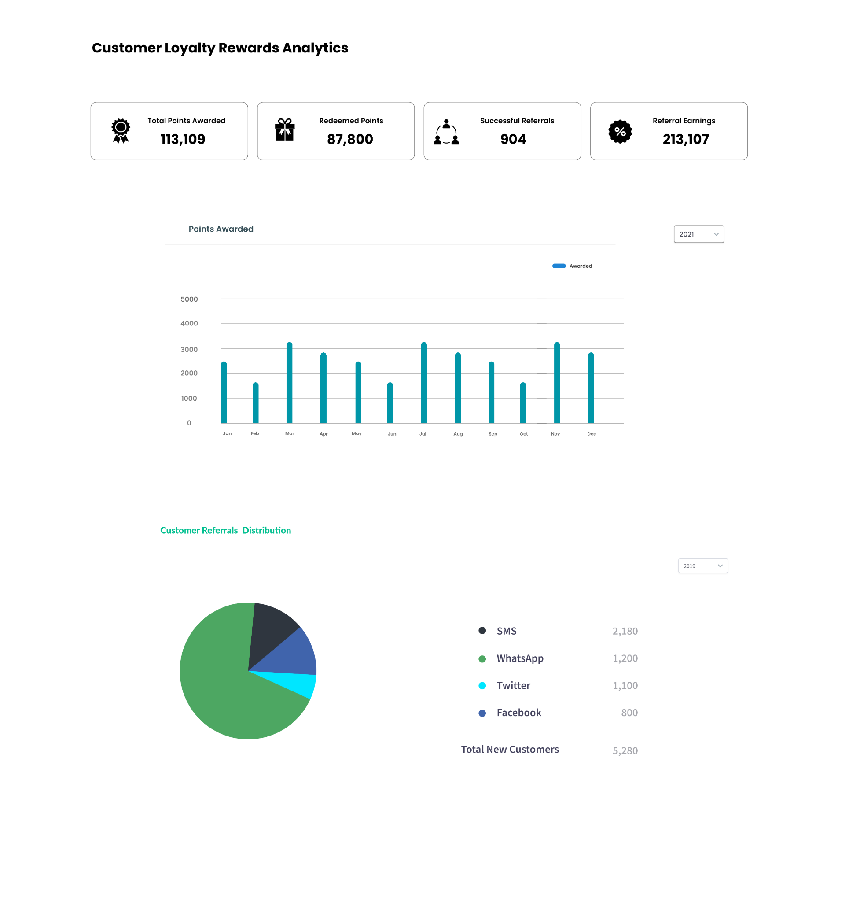
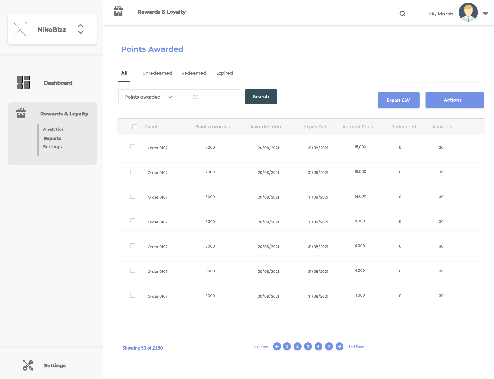
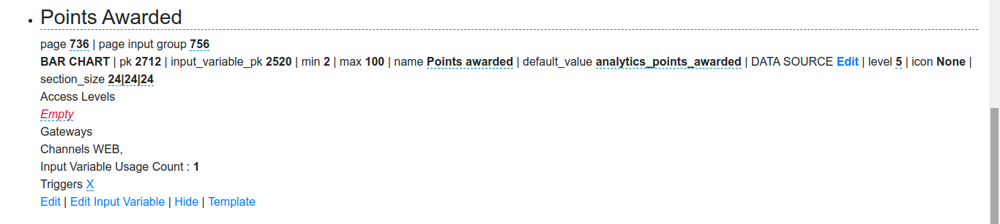
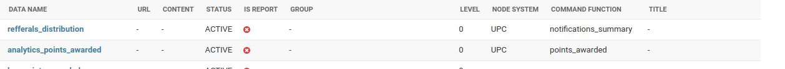
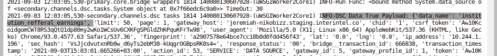
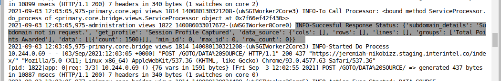
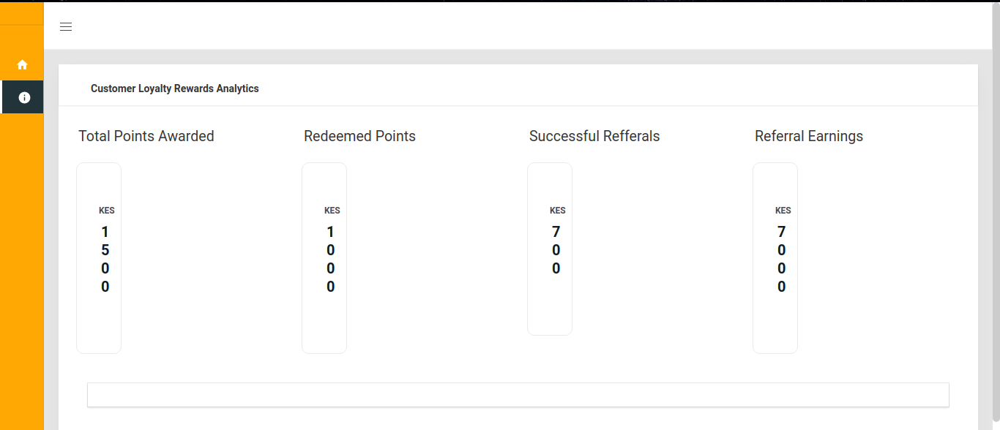
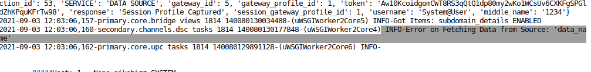

### Section 1: Use Case.
1. Institution goes to the analytics page.
2. Institution is able to view:  
   - The total points awarded to its customers. <br />
   - Total redeemed points by its customers. <br />
   - Total successful referrals by its customers <br />
   - Total referral earnings. <br />
   
  The above information is displayed in SUMMARY BOXES, BAR CHART, PIE CHART and TABLE. <br />
  For BAR CHART - Points Awarded

### Section 2: Wireframes.
    </img>
    </img>
 
### Section 3: Pseudo code (BAR CHART element)
1. SET the below values to the input variable of variable type BAR CHART   
   - default value -> 'analytics_points_awarded' (data list data name to CREATED in step 2 below) <br />
   - service - DATA SOURCE
   -details - {"x_index": "4", "y_index": "0"} 
   
2. CREATE a Data List pointing to UPC node/module with command_function 'points_awarded' in primary/core/upc/data.py : <br />
   - Data name: analytics_points_awarded <br />
   - Data response type: DATA
   
3. CREATE command_function 'points_awarded'

 
 ### Section 4: Implementation (Actual Code)

#### Screenshots

Page input with input variable of variable type BAR CHART 

 </img> 

Data List with command_function 'points_awarded' and Data response type: DATA 

 </img>


 command function points_awarded:
 
 ```
 # primary/core/upc/data.py
 
class Data:
	def points_awarded(self, payload, gateway_profile, profile_tz, data):
		params = {}
		params['cols'] = []

		params['data'] = []
		params['lines'] = []

		max_id = 0
		min_id = 0
		ct = 0
		push = {}
        
		lgr.info('Started points_awarded')
        
		item1 = {"January": 23, "February": 78}
		item2 = {"March": 43, "April": 27}
        
		params['rows'] = [item1, item2]       

		return params,max_id,min_id,ct,push 

```


 ### Section 5: Issues
 
 1. I used the above aproach  to make the SUMMARY BOXES element call the DATA SOURCE  and it was generating a payload with data name as shown by logs <br />
 
  </img>
 
  and the response 
 
  </img>
 
 The values in 'data': [] display on the SUMMARY BOXES as shown:
 
   </img>
  
 
 2. However, i don't get the payload with the data name generated by the BAR CHART as shown by error log below:
 
   </img>ES 